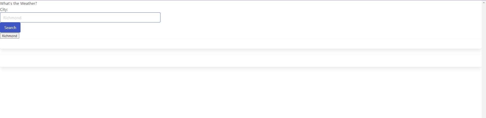

# Description

Website uses OpenWeather API to request weather data based on city search. City name is linked to specific coordinates which are used to call weather data. Searched cities appear as a button for easily clicking back to previously searched city.

# Screenshot

# Deployed Application

https://benbryant98.github.io/current-weather/
